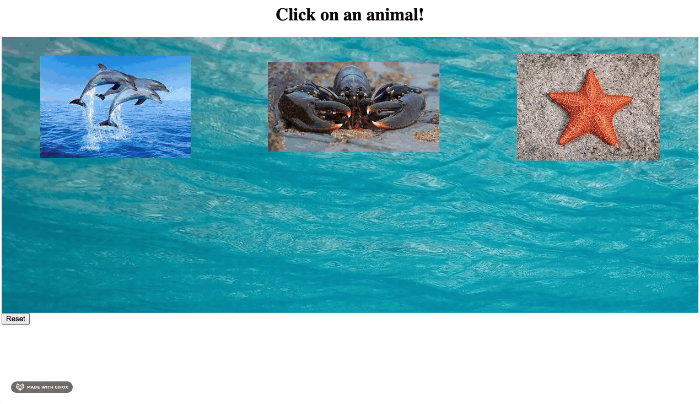

Click on an animal to see a fun fact about them!

Extrapolated from a [Codecademy](https://www.codecademy.com/learn/learn-react-introduction) project. I adapted the legacy React to React 18, generated all the CSS, and changed other necessary elements to bring it to life in a Vite React project. I also added some spice! Clicking each animal changes the title and in some cases the image sizing and background - and there's a reset button at the bottom in case things get a little too crazy.

